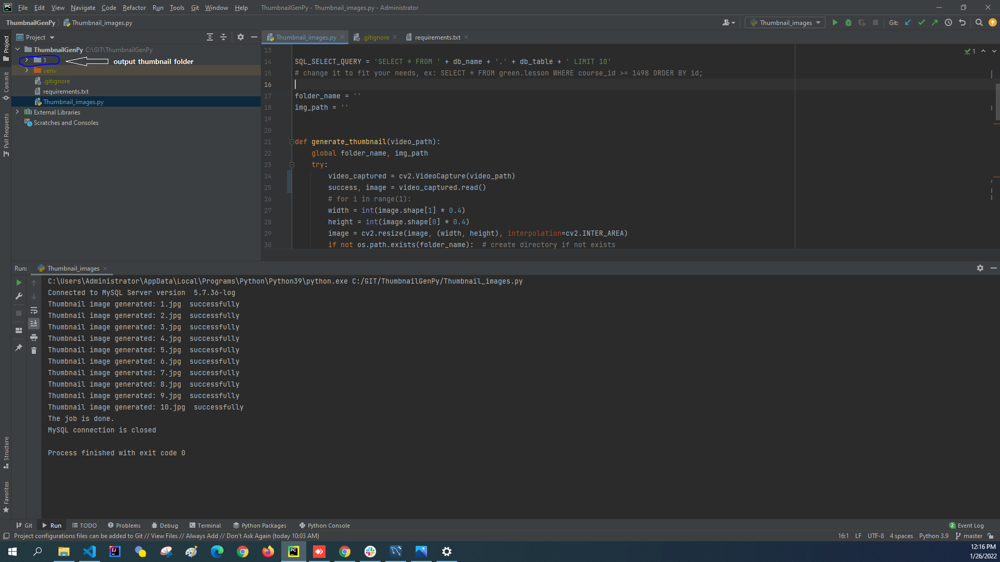

## Thumbnail Generator Application
Generate thumbnail images from video files that are fetched from a MySQL database

- uses: 
  - OpenCV and Numpy for image processing
  - MySQL for fetching video file url

### Screenshot 

### Contributors

1. [Jumanazar Said](https://github.com/jsr1611)
2. [Ali A. Al-Hamid](https://github.com/engalihamid)
